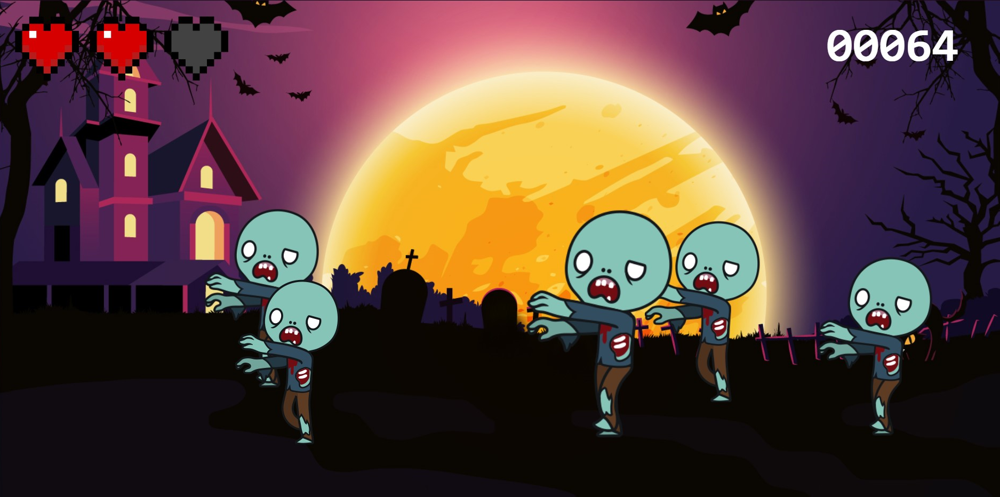

# Zombie Shooter Game

Welcome to **Zombie Shooter Game** – a simple browser-based game where you eliminate zombies before they get past you. Your goal is to score as many points as possible before you run out of hearts. 

The game is hosted on GitHub Pages - play it here: [Zombie Shooter Game](https://tommyfurgi.github.io/zombie-shooter-game/)

# How to Play
1. Press the Start Game button to begin.
2. Click on the zombies to eliminate them before they disappear.
3. Your score is displayed in the top right corner.
4. If you lose all hearts, the game ends and your score will be displayed on the Game Over screen.
5. Press Play again to restart the game.

# Game Mechanics
* Objective: Score as many points as possible by eliminating zombies before losing all hearts.
* Controls:
    * Click on the zombies to eliminate them.
    * Clicking the board without hitting a zombie will result in a loss of points.
* Hearts: You start with 3 hearts. Each zombie that reaches the end of its path will cost you one heart.
* Scoring: Each eliminated zombie adds 10 points to your score. Missing a click costs 3 points.
